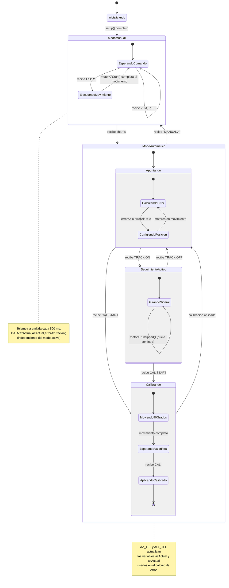
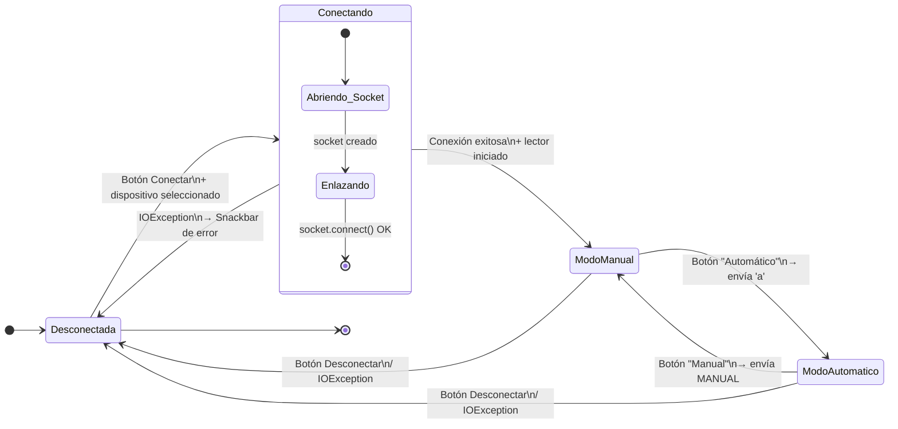
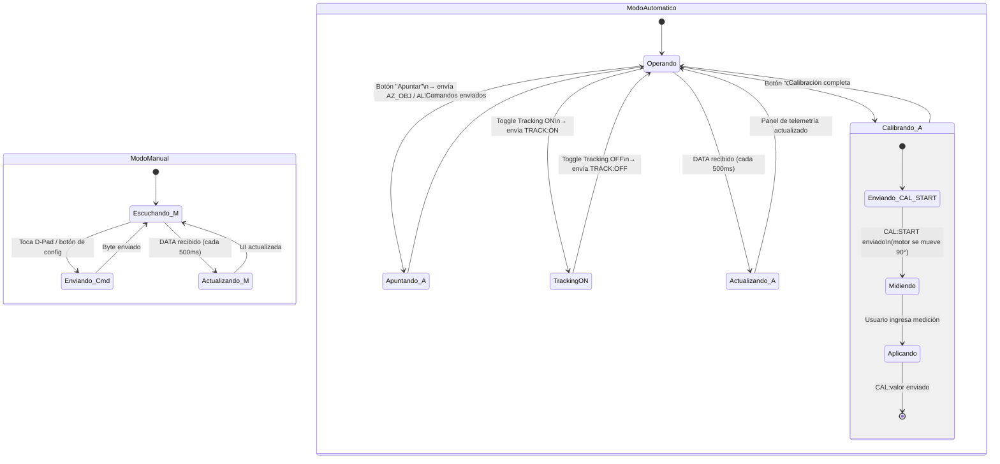
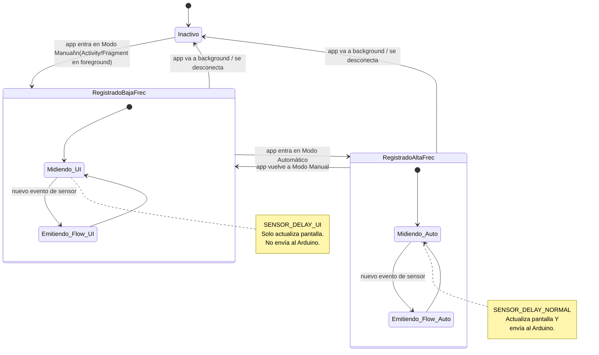

# 02 — Diagrama de Máquina de Estados (UML State Machine)

> Modela el comportamiento del sistema completo: firmware Arduino + App Android.

---

## 2.1 Máquina de Estados — Firmware Arduino

**Notas de comportamiento:**
- En `Apuntando`: el Arduino recibe `AZ_TEL`/`ALT_TEL` para calcular el error angular y mueve los motores.
- En `Tracking`: el motor AR gira a velocidad sideral constante (`motorX.runSpeed()`).
- En `Calibrando`: el motor AR se mueve 90° teóricos; al recibir `CAL:<valor>` actualiza `pasosPorGrado`.

---

## 2.2 Máquina de Estados — App Android (Conexión)

> El primer nivel del ciclo de vida de la app: gestión de la conexión Bluetooth.

---

## 2.3 Máquina de Estados — App Android (Operación por Modo)

> Detalle interno de los dos modos operativos una vez establecida la conexión.

**Nota — Sensores en cada modo:**
| Modo | Frecuencia | Enviado al Arduino |
|------|:----------:|--------------------|
| Manual | `SENSOR_DELAY_UI` (~60 ms) | ❌ Solo visualización en pantalla |
| Automático | `SENSOR_DELAY_NORMAL` (~200 ms) | ✅ `AZ_TEL:<val>` y `ALT_TEL:<val>` |

---

## 2.4 Ciclo de Vida de los Sensores del Teléfono

---

## 2.5 Tabla de Transiciones Consolidada

| Estado Origen (App) | Evento / Condición | Estado Destino | Acción |
|---------------------|--------------------|----------------|--------|
| Desconectada | Botón Conectar + dispositivo válido | Conectando | Abre coroutine de conexión en IO |
| Conectando | `socket.connect()` exitoso | ModoManual | Inicia lector + sensores baja freq |
| Conectando | `IOException` | Desconectada | Snackbar error, libera socket |
| ModoManual | Botón "Automático" | ModoAutomatico | Envía `'a'`, sube freq sensores |
| ModoAutomatico | Botón "Manual" | ModoManual | Envía `"MANUAL"`, baja freq sensores |
| Cualquier modo conectado | `IOException` en read() | Desconectada | Cierra socket, emite estado |
| Cualquier modo conectado | Botón Desconectar | Desconectada | Cierra socket limpiamente |
| ModoManual | Timeout telemetría > 2 s | ModoManual | Alerta visual (sin cambio de estado) |
| ModoAutomatico | Toggle Tracking → ON | TrackingON | Envía `"TRACK:ON"` |
| TrackingON | Toggle Tracking → OFF | Operando | Envía `"TRACK:OFF"` |
| Operando | Botón "Calibrar" | Calibrando_A | Envía `"CAL:START"` |
| Calibrando_A | Usuario ingresa medición | Aplicando | Calcula y envía `"CAL:<val>"` |
