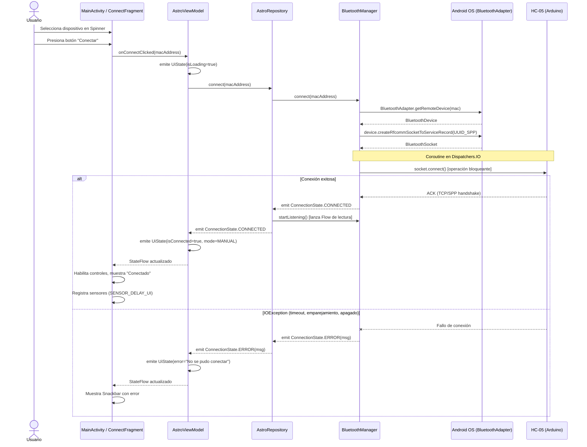
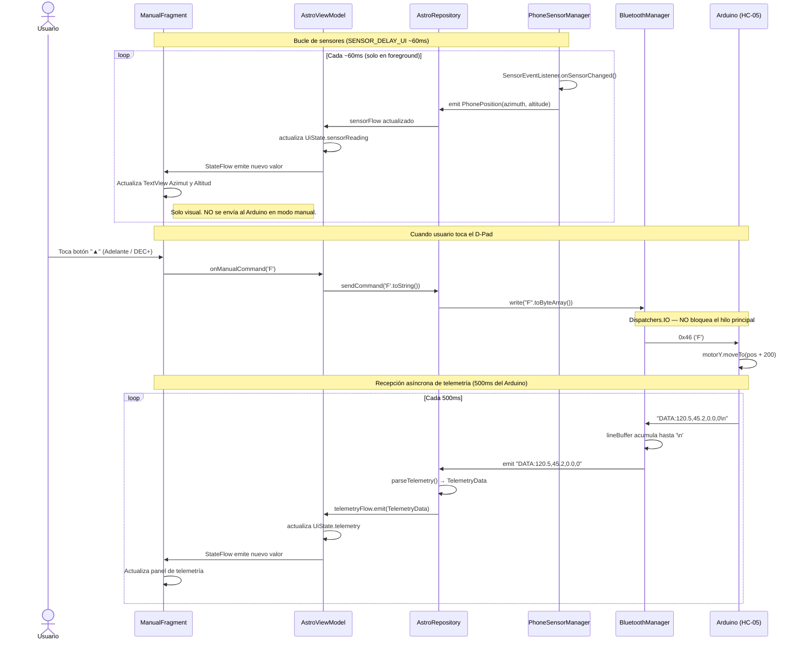
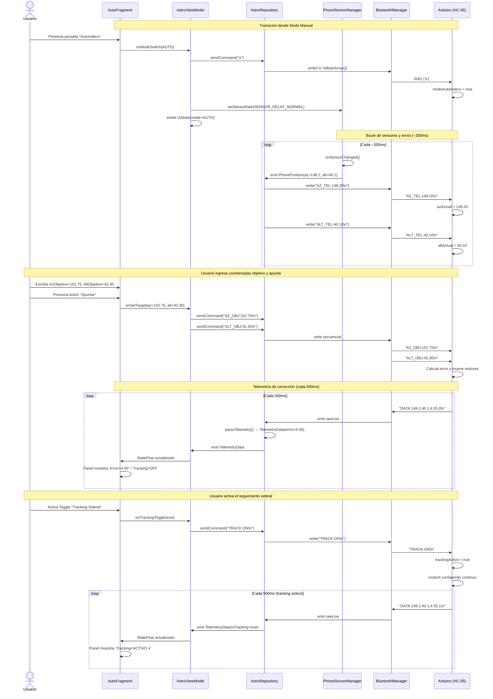
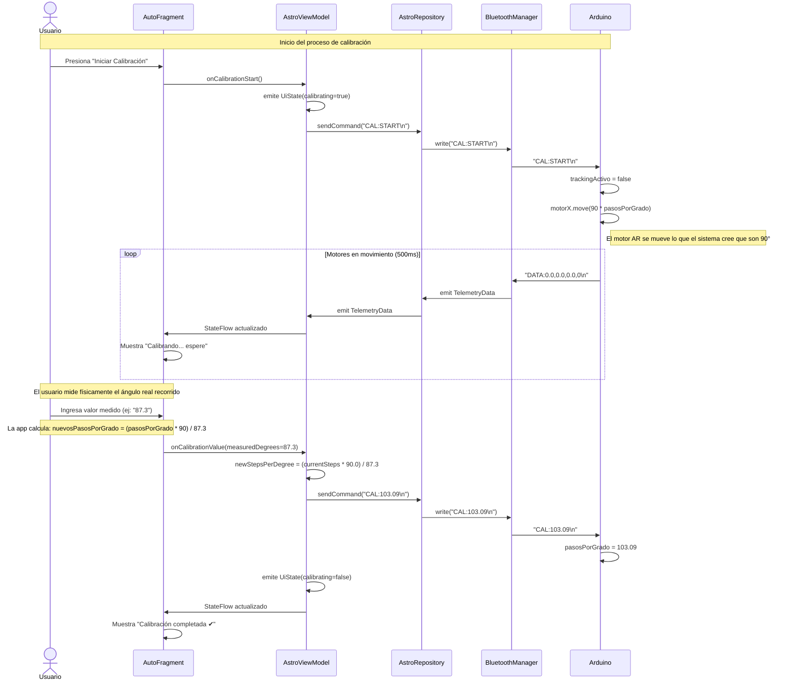
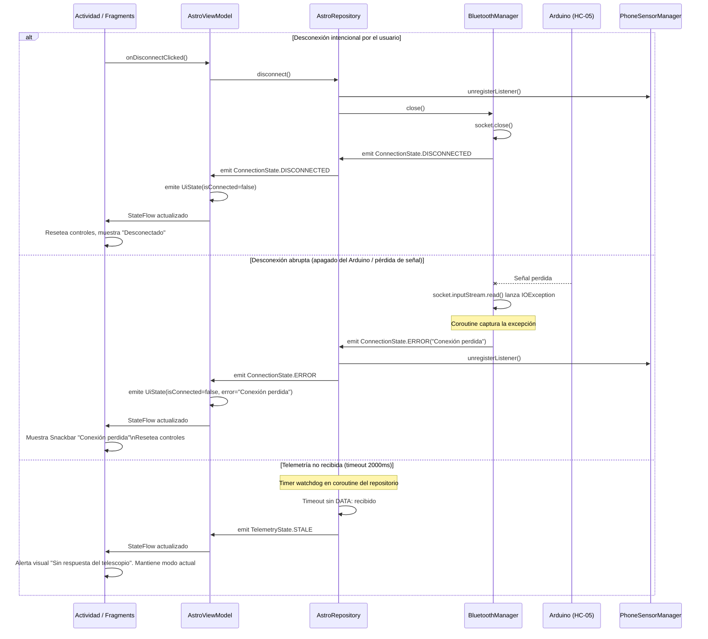

# 03 — Diagramas de Secuencia UML (Astrotracker)

> Cubren los **5 flujos críticos** del sistema ordenados de mayor a menor frecuencia de ocurrencia.

---

## Flujo 1: Conexión Bluetooth (SPP)

Ocurre una vez por sesión al iniciar la app.

---

## Flujo 2: Modo Manual — D-Pad + Visualización de Sensores

Ocurre repetidamente mientras el usuario opera manualmente el telescopio.

---

## Flujo 3: Modo Automático — Envío de Coordenadas y Telemetría

Flujo central del sistema astronómico.

---

## Flujo 4: Calibración de Pasos por Grado

Procedimiento de configuración de precisión del sistema.

---

## Flujo 5: Desconexión y Manejo de Errores

