# 04 — Diagrama de Clases UML (Arquitectura Android — Astrotracker)

> Lenguaje: Kotlin | Arquitectura: MVVM + Repository Pattern + Clean Architecture  
> Asincronía: Kotlin Coroutines + StateFlow/SharedFlow

---

## 4.1 Vista General de Capas

```
┌─────────────────────────────────────────────────────────────┐
│                    CAPA DE PRESENTACIÓN (UI)                 │
│  MainActivity  │  ManualFragment  │  AutoFragment            │
│  (View Binding + lifecycleScope para observar StateFlow)     │
└──────────────────────────┬──────────────────────────────────┘
                           │ observe / call
┌──────────────────────────▼──────────────────────────────────┐
│                    CAPA DE PRESENTACIÓN (VM)                 │
│  AstroViewModel                                              │
│  (Sobrevive rotaciones, expone StateFlow a la UI)            │
└──────────────────────────┬──────────────────────────────────┘
                           │ call (suspending / Flow)
┌──────────────────────────▼──────────────────────────────────┐
│                    CAPA DE DATOS (Repository)                │
│  AstroRepository                                             │
│  (Coordina BluetoothManager + PhoneSensorManager)           │
└────────────┬─────────────────────────┬───────────────────────┘
             │                         │
┌────────────▼──────────┐   ┌──────────▼──────────────────────┐
│   BluetoothManager    │   │      PhoneSensorManager          │
│  (Socket SPP + Flow)  │   │  (Rotation Vector + Flow)        │
└───────────────────────┘   └──────────────────────────────────┘
```

---

## 4.2 Diagrama de Clases Completo

```mermaid
classDiagram
    direction TB

    %% =============================================
    %% ENUMS Y DATA CLASSES (Modelos de Dominio)
    %% =============================================

    class AppMode {
        <<enumeration>>
        MANUAL
        AUTOMATIC
    }

    class ConnectionState {
        <<enumeration>>
        DISCONNECTED
        CONNECTING
        CONNECTED
        ERROR
    }

    class TelemetryState {
        <<enumeration>>
        FRESH
        STALE
    }

    class TelemetryData {
        <<data class>>
        +azActual: Float
        +altActual: Float
        +errorAz: Float
        +isTracking: Boolean
        +state: TelemetryState
    }

    class PhonePosition {
        <<data class>>
        +azimuth: Float
        +altitude: Float
        +timestamp: Long
    }

    class AstroUiState {
        <<data class>>
        +connectionState: ConnectionState
        +mode: AppMode
        +telemetry: TelemetryData?
        +phonePosition: PhonePosition?
        +pairedDevices: List~BluetoothDeviceInfo~
        +isCalibrating: Boolean
        +errorMessage: String?
        +stepsPerDegree: Float
    }

    class BluetoothDeviceInfo {
        <<data class>>
        +name: String
        +macAddress: String
    }

    %% =============================================
    %% CAPA DE HARDWARE — BluetoothManager
    %% =============================================

    class BluetoothManager {
        <<class>>
        -SPP_UUID: UUID$
        -socket: BluetoothSocket?
        -outputStream: OutputStream?
        -ioScope: CoroutineScope
        -_connectionState: MutableSharedFlow~ConnectionState~
        +connectionState: SharedFlow~ConnectionState~
        +connect(device: BluetoothDevice): Unit
        +disconnect(): Unit
        +write(data: String): Unit
        +listenForLines(): Flow~String~
        -openSocket(device: BluetoothDevice): BluetoothSocket
    }

    class PhoneSensorManager {
        <<class>>
        -androidSensorMgr: SensorManager
        -rotationVectorSensor: Sensor?
        -_positionFlow: MutableSharedFlow~PhonePosition~
        +positionFlow: SharedFlow~PhonePosition~
        +startListening(delay: Int): Unit
        +stopListening(): Unit
        -computeAzimuthAndAltitude(event: SensorEvent): PhonePosition
    }

    %% =============================================
    %% CAPA DE DATOS — Repository
    %% =============================================

    class AstroRepository {
        <<class>>
        -btManager: BluetoothManager
        -sensorManager: PhoneSensorManager
        -repoScope: CoroutineScope
        -watchdogJob: Job?
        -_telemetryFlow: MutableSharedFlow~TelemetryData~
        -_connectionFlow: MutableSharedFlow~ConnectionState~
        +telemetryFlow: SharedFlow~TelemetryData~
        +connectionFlow: SharedFlow~ConnectionState~
        +phonePositionFlow: SharedFlow~PhonePosition~
        +getPairedDevices(): List~BluetoothDeviceInfo~
        +connect(macAddress: String): Unit
        +disconnect(): Unit
        +sendRawCommand(cmd: String): Unit
        +sendManualCommand(char: Char): Unit
        +sendAutoTarget(az: Float, alt: Float): Unit
        +sendPhonePosition(pos: PhonePosition): Unit
        +setTracking(enabled: Boolean): Unit
        +setSiderealSpeed(stepsPerSec: Float): Unit
        +startCalibration(): Unit
        +applyCalibration(measuredDeg: Float, currentSteps: Float): Unit
        +switchToManual(): Unit
        +switchToAuto(): Unit
        -parseTelemetry(line: String): TelemetryData?
        -startTelemetryWatchdog(): Unit
        -startReadingLoop(): Unit
    }

    %% =============================================
    %% CAPA DE PRESENTACIÓN — ViewModel
    %% =============================================

    class AstroViewModel {
        <<class>>
        -repository: AstroRepository
        -viewModelScope: CoroutineScope
        -_uiState: MutableStateFlow~AstroUiState~
        +uiState: StateFlow~AstroUiState~
        +onDeviceSelected(mac: String): Unit
        +onConnectClicked(): Unit
        +onDisconnectClicked(): Unit
        +onManualCommand(char: Char): Unit
        +onSwitchMode(mode: AppMode): Unit
        +onSetTarget(az: Float, alt: Float): Unit
        +onTrackingToggle(enabled: Boolean): Unit
        +onSpeedChanged(stepsPerSec: Float): Unit
        +onCalibrationStart(): Unit
        +onCalibrationValue(measuredDeg: Float): Unit
        -observeRepository(): Unit
        -handleConnectionState(state: ConnectionState): Unit
        -handleTelemetry(data: TelemetryData): Unit
        -handlePhonePosition(pos: PhonePosition): Unit
    }

    %% =============================================
    %% CAPA DE UI — Vistas
    %% =============================================

    class MainActivity {
        <<Activity>>
        -binding: ActivityMainBinding
        -viewModel: AstroViewModel
        +onCreate(): Unit
        +setupSpinner(): Unit
        +setupNavigation(): Unit
        -observeUiState(): Unit
        -requestBluetoothPermissions(): Unit
    }

    class ManualFragment {
        <<Fragment>>
        -binding: FragmentManualBinding
        -viewModel: AstroViewModel
        +onViewCreated(): Unit
        -setupDPad(): Unit
        -setupModeButton(): Unit
        -observeSensorDisplay(): Unit
        -observeTelemetry(): Unit
    }

    class AutoFragment {
        <<Fragment>>
        -binding: FragmentAutoBinding
        -viewModel: AstroViewModel
        +onViewCreated(): Unit
        -setupTargetInputs(): Unit
        -setupTrackingToggle(): Unit
        -setupCalibrationUI(): Unit
        -observeTelemetry(): Unit
        -observeSensorDisplay(): Unit
        -updateTelemetryPanel(data: TelemetryData): Unit
    }

    class CommandProtocol {
        <<object — Singleton>>
        +MANUAL_FORWARD: Char$
        +MANUAL_BACK: Char$
        +MANUAL_RIGHT: Char$
        +MANUAL_LEFT: Char$
        +MANUAL_SET_ZERO: Char$
        +MANUAL_SET_MAX: Char$
        +MANUAL_REQUEST_POS: Char$
        +MANUAL_SPEED_UP: Char$
        +MANUAL_SPEED_DOWN: Char$
        +MANUAL_TO_AUTO: Char$
        +AUTO_TO_MANUAL: String$
        +TRACK_ON: String$
        +TRACK_OFF: String$
        +CAL_START: String$
        +buildAzObj(az: Float): String$
        +buildAltObj(alt: Float): String$
        +buildAzTel(az: Float): String$
        +buildAltTel(alt: Float): String$
        +buildCalValue(steps: Float): String$
        +buildVelocity(v: Float): String$
        +parseTelemetry(line: String): TelemetryData?$
    }

    %% =============================================
    %% RELACIONES
    %% =============================================

    %% UI → ViewModel
    MainActivity --> AstroViewModel : observa StateFlow\ninicia ViewModel
    ManualFragment --> AstroViewModel : observa / llama eventos
    AutoFragment --> AstroViewModel : observa / llama eventos
    MainActivity *-- ManualFragment : aloja (FragmentManager)
    MainActivity *-- AutoFragment   : aloja (FragmentManager)

    %% ViewModel → Repository
    AstroViewModel --> AstroRepository : inyectado (Application Context)
    AstroViewModel ..> AstroUiState : produce
    AstroViewModel ..> AppMode      : usa

    %% Repository → Hardware
    AstroRepository --> BluetoothManager    : inyectado
    AstroRepository --> PhoneSensorManager  : inyectado
    AstroRepository ..> TelemetryData       : produce
    AstroRepository ..> CommandProtocol     : usa (construye strings)

    %% Modelos
    AstroUiState *-- TelemetryData    : agrega
    AstroUiState *-- PhonePosition    : agrega
    AstroUiState --> ConnectionState  : contiene
    AstroUiState --> AppMode          : contiene
    TelemetryData --> TelemetryState  : contiene
    AstroRepository ..> PhonePosition : produce (relay del sensor)

    %% Protocolo
    CommandProtocol ..> TelemetryData : parsea y produce
```



---

## 4.3 Descripción de Responsabilidades

### `CommandProtocol` (Singleton / Companion Object)
> **Patrón:** Facade + centralización del protocolo  
> Toda la lógica de serialización y parseo de mensajes reside aquí. Si el Arduino cambia su protocolo, **solo se modifica esta clase**. Evita strings mágicos dispersos por el código.

```
buildAzObj(152.75f) → "AZ_OBJ:152.75\n"
parseTelemetry("DATA:120.5,45.2,1.1,1") → TelemetryData(azActual=120.5, ...)
```

---

### `BluetoothManager`
> **Patrón:** Repository de bajo nivel + Flow reactivo  
> Opera exclusivamente en `Dispatchers.IO`. Expone `listenForLines()` como un `Flow<String>` que emite **líneas completas** terminadas en `\n`. El consumidor (Repository) no necesita saber nada del buffer TCP/SPP.

**Bug prevenido:** El `InputStream.read()` es bloqueante. Correr esto fuera de `Dispatchers.IO` congela el hilo principal y provoca ANR.

---

### `PhoneSensorManager`
> **Patrón:** Adapter (adapta la API de SensorManager de Android a un Flow de Kotlin)  
> Registra `TYPE_ROTATION_VECTOR` y convierte `SensorEvent` → `PhonePosition`.  
> Soporta dos modos de delay: `SENSOR_DELAY_UI` (manual) y `SENSOR_DELAY_NORMAL` (automático), cambiables en tiempo de ejecución re-registrando el listener.

**Bug prevenido:** Si los sensores se registran sin desregistrarse al ir a background, drenan batería continuamente. El ciclo de vida está gestionado por el Repository que escucha el `AppMode`.

---

### `AstroRepository`
> **Patrón:** Repository + Mediator  
> Coordina `BluetoothManager` y `PhoneSensorManager`. Tiene un **watchdog** (coroutine con `withTimeout`) que emite `TelemetryState.STALE` si no recibe `DATA:` en 2 segundos.  
> En Modo Automático, observa el `positionFlow` del sensor y envía `AZ_TEL` / `ALT_TEL` al Arduino.  
> En Modo Manual, no envía los datos del sensor al Arduino, pero los sigue re-emitiendo al ViewModel para la UI.

**Bug prevenido:** Si el parseo de `DATA:` fallara con una excepción sin capturar, el `Flow` entero moriría y dejaría de llegar telemetría. Todo el parseo está encapsulado con `runCatching`.

---

### `AstroViewModel`
> **Patrón:** MVVM ViewModel + StateFlow como Single Source of Truth  
> Sobrevive a rotaciones de pantalla. Toda la UI deriva su estado de `uiState: StateFlow<AstroUiState>`. Un único objeto `AstroUiState` (inmutable, `data class`) representa el estado completo de la pantalla en un momento dado.

**Bug prevenido:** Sin ViewModel, la conexión Bluetooth se cortaría al rotar el teléfono porque la Activity (que albergaría el socket) sería destruida y reconstruida.

---

### `MainActivity` / `ManualFragment` / `AutoFragment`
> **Patrón:** Observer (via `lifecycleScope.launchWhenStarted`)  
> Solo responsabilidades de presentación. Observan `uiState` y delegan toda acción al ViewModel. **No contienen lógica de negocio ni de comunicación.**

---

## 4.4 Estructura de Paquetes Propuesta

```
com.pebete.astrotracker/
├── ui/
│   ├── MainActivity.kt
│   ├── manual/
│   │   └── ManualFragment.kt
│   └── auto/
│       └── AutoFragment.kt
├── viewmodel/
│   ├── AstroViewModel.kt
│   └── AstroUiState.kt         ← data class + enums AppMode, ConnectionState, etc.
├── repository/
│   └── AstroRepository.kt
├── data/
│   ├── bluetooth/
│   │   └── BluetoothManager.kt
│   ├── sensor/
│   │   └── PhoneSensorManager.kt
│   └── model/
│       ├── TelemetryData.kt
│       └── PhonePosition.kt
└── protocol/
    └── CommandProtocol.kt      ← Singleton con todas las constantes y parsers
```
